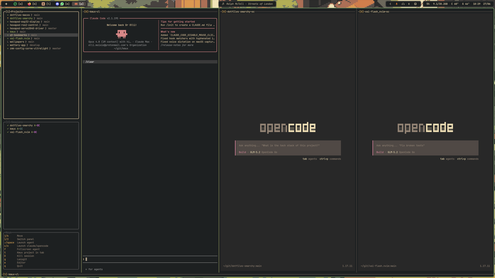

# kmux

> [!WARNING]
> Kmux has a lot of very specific dependencies unique to my own workflow
> (lazygit, worktrunk, sidekick.nvim). As such, it's not intended to be general
> or particularly configurable.

`kmux` is a barebones TUI for monitoring parallel AI coding agents (claude,
opencode) that each run in their own tmux session. It runs as a left sidebar
inside a kitty window and auto-attaches every matching tmux session into its own
pane.



## Prerequisites

- **kitty** with remote control enabled. In `~/.config/kitty/kitty.conf`:

  ```
  allow_remote_control yes
  listen_on unix:@kitty
  ```
- **tmux**
- **Go** 1.21+ (to build)

## Install

```sh
curl -fsSL https://raw.githubusercontent.com/olli-io/kmux/main/install.sh | sh
```

Or, from a checkout:

```sh
./install.sh
```

It builds from source and installs `kmux` to `~/.local/bin` (override with
`INSTALL_DIR` or `PREFIX`). Make sure the install dir is on your `PATH`.

## Run

Run it **inside a kitty window** — that window becomes the sidebar and agent
panes open to its right:

```sh
kmux
```

Pass a directory to scope kmux to a single git project. The path may be the main
worktree, a linked worktree, or any subdirectory of one:

```sh
kmux ~/git/myproject   # or: cd into the repo and run `kmux .`
```

## Idle slots

The empty columns kmux pads the layout with aren't just filler — they're
launchers. Focus an idle slot and:

- **`c`** / **`o`** — pick a project, then launch Claude / OpenCode in it.
- **`↵`** — pick a project, then pick the agent kind.

The picker lists the same projects (and worktrees) as the `[1]─Projects` panel.
On select, the agent starts **in that same pane** — instantly — and the dashboard
adopts it as a managed agent pane.

An idle slot itself is held by a tiny shell loop (it only draws the hint and
waits for a keypress), so it costs a shell, not a whole process. The picker —
**`kmux-idler`**, a small separate binary installed beside `kmux` — is spawned
only for the moment you're choosing, then replaces itself with the agent. If
`kmux-idler` is missing, idle slots fall back to inert placeholders.

## Launch an agent directly

With `--agent`, kmux skips the dashboard and creates (or attaches to) the tmux
session for one agent in the project containing the given path, attaching it to
the current terminal. This needs only tmux — no kitty:

```sh
kmux ~/git/myproject --agent claude     # path then flag
kmux --agent opencode ~/git/myproject   # flag then path, equivalent
kmux --agent claude                     # omit the path to use the current dir
```

The session name follows the same convention the dashboard uses
(`[kmux][CC]<project-path>` for claude, `[kmux][OC]…` for opencode; worktrees
become `[kmux][CC]<project-path>@<worktree>`, e.g.
`[kmux][CC]~/git/myproject@feat`), so an agent launched this way is the very same
session the dashboard manages — launch it here, then open `kmux`, and it focuses
that running agent.

## Print a session name

`--session` resolves the very same session name without launching anything and
prints it to stdout, for scripting against the running agent. Like `--agent` it
takes a kind and an optional path (default: the current directory), and needs
neither tmux nor kitty:

```sh
kmux --session claude                   # e.g. [kmux][CC]~/git/myproject
kmux --session opencode ~/git/myproject # name for a specific path
tmux send-keys -t "$(kmux --session claude)" 'hello' Enter
```

## Config

kmux reads a **default config shipped beside the binary** (installed as
`config.yaml` next to `kmux`), then overlays your optional
`~/.config/kmux/config.yaml` on top. You don't need to copy the default — just
create your own file with the keys you want to change.

```yaml
# Extra project folders for the Projects panel (added to the ~/git discovery).
projects:
  - ~/work/some-repo

# Kill an agent whose pane sits unchanged this long (Go duration; off disables).
idle_timeout: 2h

# Custom command keybindings (the editor and lazygit bindings live here).
customCommands:
  - key: e
    title: Editor
    cmd: $EDITOR {dir}
  - key: g
    title: Lazygit
    cmd: lazygit

# Navigation keybindings — remap any action's key (defaults live in the binary).
# keybindings:
#   killAgent: x
```

See **[docs/configuration.md](docs/configuration.md)** for the full reference:
how config layers combine, all `customCommands` fields and `cmd:` placeholders,
`target:` modes, and the complete list of rebindable navigation keybindings.
